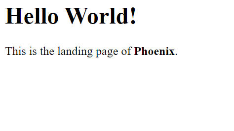

# Set-up & Install LAMP Stack on Ubuntu 20.04
This guide documents how to set up a LAMP stack on my Ubuntu living in a virtualbox on Windows10

It is majorly a 4-step process. Which are:
1. Installing Apache and updating the firewall
1. Installing MySQL
1. Installing PHP
2. Creation of Virtual Host for your website.

### Prerequisites
You'll need to have an Ubuntu 20.04 server with a non-root sudo-enabled user account, install OpenSSH-server and a basic firewall.

`$ sudo apt update`

`$ sudo apt install openssh-server`

Run this following commands as a root user using **sudo su -** . Input your password to let you in. Exit the root user when you're done and continue as your non-root sudo-enabled user.

`$ ufw allow OpenSSH`

`$ ufw enable`

`$ ufw status`

```
Output

Status: active

To                         Action      From
--                         ------      ----
OpenSSH                    ALLOW       Anywhere                                   
OpenSSH (v6)               ALLOW       Anywhere (v6)             
```

### Installing Apache and updating the firewall

`sudo apt update`
`sudo apt install apache2`
`sudo ufw app list`

```
Output

Available applications:
  Apache
  Apache Full
  Apache Secure
  CUPS
  OpenSSH

```

You can go a step further and check if apache2 is running, by typing:

`systemctl status apache2`

```
Output

● apache2.service - The Apache HTTP Server
     Loaded: loaded (/lib/systemd/system/apache2.service; enabled; vendor preset: enabled)
     Active: active (running) since Mon 2021-03-15 17:10:18 WAT; 1 day 23h ago
       Docs: https://httpd.apache.org/docs/2.4/
   Main PID: 21102 (apache2)
      Tasks: 7 (limit: 2938)
     Memory: 13.9M
     CGroup: /system.slice/apache2.service
             ├─21102 /usr/sbin/apache2 -k start
             ├─22474 /usr/sbin/apache2 -k start
             ├─22475 /usr/sbin/apache2 -k start
             ├─22476 /usr/sbin/apache2 -k start
             ├─22477 /usr/sbin/apache2 -k start
             ├─22478 /usr/sbin/apache2 -k start
             └─22482 /usr/sbin/apache2 -k start

```

The only one we require at this point is "Apache", since there's no TLS/SSL certificate configured yet on the server.

Use the Apache profile to only allow traffic on port 80:

`sudo ufw allow in "Apache"`

`sudo ufw status`
```
Output

Status: active

To                         Action      From
--                         ------      ----
OpenSSH                    ALLOW       Anywhere                  
Apache                     ALLOW       Anywhere                  
OpenSSH (v6)               ALLOW       Anywhere (v6)             
Apache (v6)                ALLOW       Anywhere (v6)   
```

At this point you can check your ip address on the browser to see this: 


### Installing the "M" part of the Stack

Now that we've got a web server up and running, we need to install the database system to be able to store and manage data for your site. Due to our choice of stack, MySQL is the exact choice.


Install the db with:

`sudo apt install mysql-server`

For more security. Run the command below

`sudo mysql_secure_installation`

You'd get a lot of prompts at this point. Pick your choice on discretion and as you deem fit.

When you're done, test if you're able to log in 

`sudo mysql`

You can clear your screen with "CTRL + L" and exit the MySQL console, by typing:

`mysql> exit`
```
Output 

Welcome to the MySQL monitor.  Commands end with ; or \g.
Your MySQL connection id is 10
Server version: 8.0.23-0ubuntu0.20.04.1 (Ubuntu)

Copyright (c) 2000, 2021, Oracle and/or its affiliates.

Oracle is a registered trademark of Oracle Corporation and/or its
affiliates. Other names may be trademarks of their respective
owners.

Type 'help;' or '\h' for help. Type '\c' to clear the current input statement.

mysql> exit
Bye

```

However, it is very important to note
> even though you didn’t need to provide a password to connect as the root user
> formatting syntax is to make it as readable
>  you have defined one when running the mysql_secure_installation script. That is because the default
> authentication method for the administrative MySQL user is unix_socket instead of password. Even though this might look like a security concern at first, it makes the database server , it makes the database server more secure because the only users allowed to log in as the root MySQL user are the system users with sudo privileges connecting from the console or through an application running with the same privileges.
> In practical terms, that means you won’t be able to use the administrative database root user to connect from your PHP application. Setting a password for the root MySQL account works as a safeguard, in case the default authentication method is changed from unix_socket to password.

The MySQL server is now installed and secured. Next, we’ll install PHP, the final component in the LAMP stack.


### Bringing in the popular "P"


The  PHP is the component of our setup that will process code to display dynamic content to the final user. In addition to the php package, you’ll need **php-mysql** ( a PHP module that allows PHP to communicate with MySQL-based databases). You’ll also need **libapache2-mod-php** to enable Apache to handle PHP files.

To install these packages, run:

`sudo apt install php libapache2-mod-php php-mysql`

Check your PHP version once the installation is complete with: 

`php -v`

```
Output

PHP 7.4.3 (cli) (built: Nov  2 2022 09:53:44) ( NTS )
Copyright (c) The PHP Group
Zend Engine v3.4.0, Copyright (c) Zend Technologies
    with Zend OPcache v7.4.3, Copyright (c), by Zend Technologies

```

✨Yippee!✨ Your LAMP stack is fully operational, but...wait a minute. Before you can test your setup with a PHP script, it’s best to set up a proper Apache Virtual Host to hold your website’s files and folders.

### Creating a Virtual Host for your Website
  In case you've used Nginx before, you must have at some point got to work with "Server Blocks", well Virtual Host is almost the equivalent in Apache. You can use it to encapsulate configuration details and host more than one domain from a single server.

  We’ll create a directory structure within /var/www for the **dodo_domain** site, leaving /var/www/html in place as the default placeholder to be served if a client request doesn’t match any other sites.

  Create the directory for your_domain as follows and assign ownership of the directory with the $USER environment variable, which will reference your current system use:

`sudo mkdir /var/www/dodo_domain`
  
`sudo chown -R $USER:$USER /var/www/dodo_domain`

Then, open a new configuration file in Apache’s sites-available directory using your preferred command-line editor. Here, I’ll use vi:

`sudo vi /etc/apache2/sites-available/dodo_domain.conf`

  This creates and opens a blank file where you can paste this: 
```
<VirtualHost *:80>
    ServerName dodo_domain
    ServerAlias www.dodo_domain
    ServerAdmin webmaster@localhost
    DocumentRoot /var/www/dodo_domain
    ErrorLog ${APACHE_LOG_DIR}/error.log
    CustomLog ${APACHE_LOG_DIR}/access.log combined
</VirtualHost>
```
Save and close by typing **:wq**

Use the plugin `a2ensite` to enable the new virtual host:

`sudo a2ensite dodo_domain`

You may want to disable the default website that comes installed with Apache, because in this case Apache’s default configuration would overwrite your virtual host. To disable Apache’s default website, type:

`sudo a2dissite 000-default`

Ensure your configuration file doesn’t contain syntax errors, and reload Apache so these changes take effect:

`sudo apache2ctl configtest`

`sudo systemctl reload apache2`

Your new website is now active, but the web root /var/www/dodo_domain is still empty. Create an index.html file in that location so that we can test that the virtual host works as expected:

`sudo vi /var/www/dodo_domain/index.html`

Paste in:
```
<html>
  <head>
    <title>dodo_domain website</title>
  </head>
  <body>
    <h1>Hello World!</h1>

    <p>This is the landing page of <strong>Phoenix</strong>.</p>
  </body>
</html>
```

Now go to your browser and access your server’s IP address once again:




You can leave this file in place as a temporary landing page for your application until you set up an index.php file to replace it. Once you do that, remember to remove or rename the index.html file from your document root, as it would take precedence over an index.php file by default.

You can change this behavior, you’ll need to edit the /etc/apache2/mods-enabled/dir.conf file and modify the order in which the index.php file is listed within the DirectoryIndex directive:

`sudo vi /etc/apache2/mods-enabled/dir.conf`

 Place the index.php before the index.html. Save, close and reload Apache.

Finally, we create a PHP test script to confirm that Apache is able to handle and process requests for PHP files.

Create a new file named info.php inside your custom web root folder: 

`sudo vi /var/www/dodo_domain/info.php`

Paste in this: 

`<?php
phpinfo();`

When you are finished, save and close the file.

To test this script, go to your web browser and access your server’s domain name or IP address, followed by the script name, which in ourcase is info.php:
```
http://server_domain_or_IP/info.php
```
You’ll see a page similar to this:


 >it’s best to remove the file you created as it contains sensitive information about your PHP environment -and your Ubuntu server.

 `sudo rm /var/www/your_domain/info.php`

 
✨Baannggg!✨So there you go! You've successfully set up your LAMP stack on an Ubuntu.

